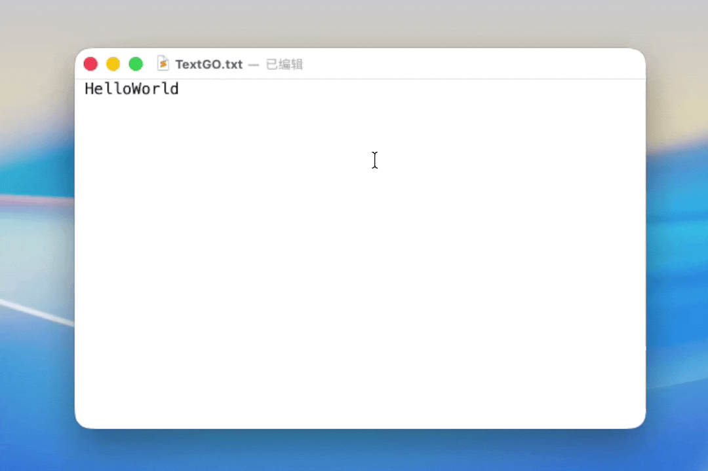
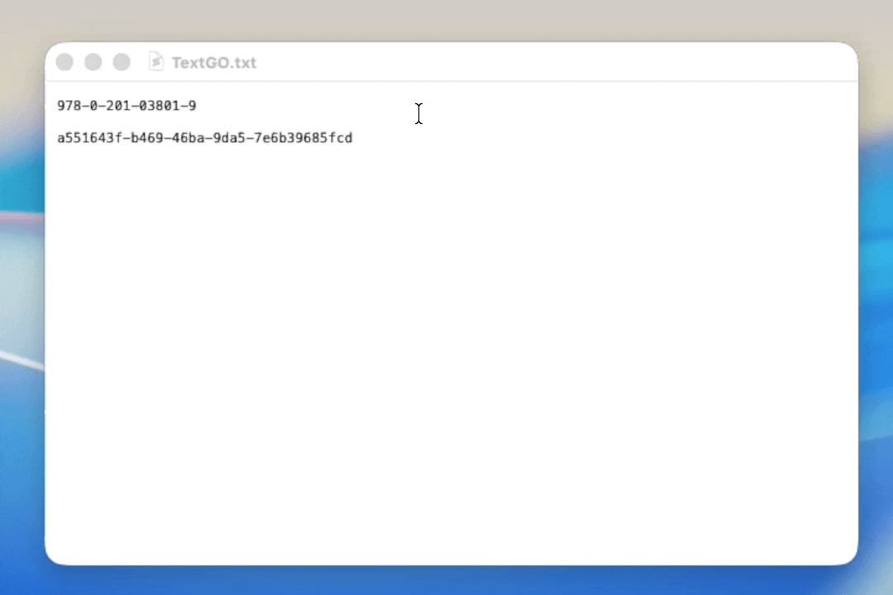
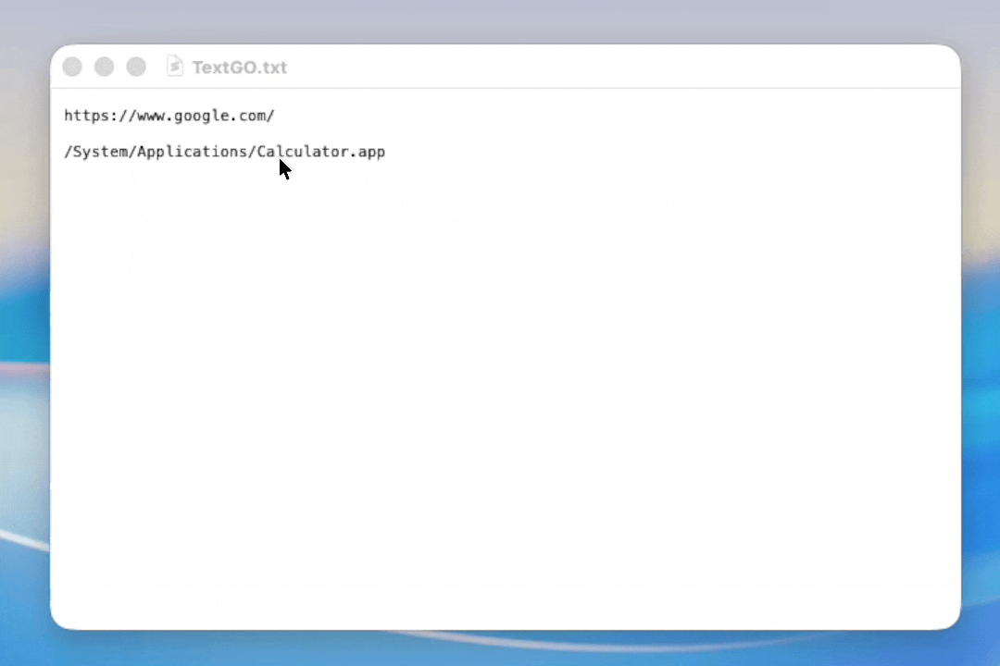

<div align="center">

[](https://github.com/C5H12O5/TextGO/releases)
[](LICENSE)
[](https://tauri.app/)
[](https://svelte.dev/)


📖 English / [简体中文](README.zh-CN.md)

</div>

> TextGO is a cross-platform text processing tool that automatically recognizes text types and executes custom actions via a global hotkey.

## ✨ Core Features

1. **Effortless Operation**: Bind multiple rules to a single hotkey, eliminating the need to remember complex key combinations.
2. **Ready to Use**: Comes with a rich set of built-in text types and processing actions, allowing for quick setup with simple configuration.
3. **Highly Extensible**: Supports extending text recognition types via regular expressions or machine learning models, and allows for custom processing logic using scripts or local AI.
4. **Cross-Platform**: Built with Tauri for native support on macOS and Windows.

## 🚀 Use Cases

_With a single hotkey, you can perform all of the following actions:_

- **Format Conversion**: Automatically recognize variable naming formats and convert them to the target style

  

- **Text Generation**: Automatically recognize business data formats and generate corresponding SQL statements

  

- **Quick Actions**: Automatically recognize URLs or file paths and open them with the default application

  

- **Text Translation**: Automatically recognize natural language text and translate it using local LLM

  

- **...and More**

## ⬇️ Getting Started

### Installation

Download the installer for your platform from [**GitHub Releases**](https://github.com/C5H12O5/TextGO/releases) and follow the installation instructions.

### FAQ

<details>
<summary>1. macOS shows "App is damaged and can't be opened."</summary>

<br>

_Run the following command in the terminal to resolve:_

```bash
sudo xattr -r -d com.apple.quarantine /Applications/TextGO.app
```

</details>

<details>
<summary>2. macOS shows "Apple can't check app for malicious software."</summary>

<br>

_Follow these steps to resolve:_

1. Open "System Settings" > "Privacy & Security"
2. Find the blocked application in the "Security" section
3. Click the "Open Anyway" button
4. Enter your login password and confirm

</details>

## 🎉 Acknowledgments

This project is built upon many excellent open source projects. We would like to express our sincere gratitude to all the developers and contributors of these projects.

For a complete list of third-party dependencies and their licenses, please see [**LICENSES.md**](LICENSES.md).

## 📄 License

This project is released under the [**GPLv3**](LICENSE) open source license.
