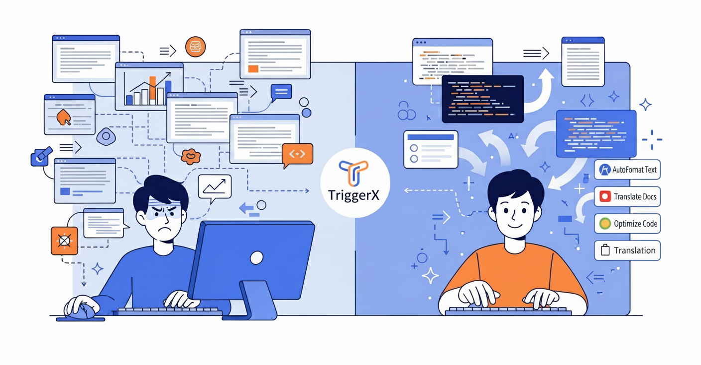

  
  <h1>TextGO</h1>
  
AI 赋能的跨平台全局快捷键应用，让智能识别简化你的工作流程

## 🎯 项目介绍

TextGO 是一个 AI 赋能的跨平台全局快捷键应用，专为现代知识工作者设计。它可以智能识别你选中的文本类型，并自动触发相应的自定义动作，从而大幅提升你的工作效率。

  
  
<em>一键触发，告别重复工作</em>

### 🚀 核心特性

- **智能文本识别**：基于正则表达式、机器学习模型和自然语言处理技术，自动识别选中文本的类型
- **自定义动作系统**：支持 JavaScript 和 Python 脚本执行，以及基于 Ollama 的本地 AI 对话
- **可训练模型**：通过输入少量样本，快速训练专属的文本类型识别模型
- **跨平台兼容**：基于 Tauri 框架，原生支持 Windows、macOS 和 Linux
- **零记忆负担**：告别传统快捷键应用需要记忆大量组合键的痛点

### 🆚 产品对比

| 特性     | TextGO       | 手动操作    | AutoHotkey    | Raycast     |
| -------- | -------------- | ----------- | ------------- | ----------- |
| 学习门槛 | 🟢 低          | 🔴 高       | 🔴 高         | 🟡 中等     |
| 智能识别 | 🟢 AI 自动识别 | 🔴 手动判断 | 🔴 需要编程   | 🟡 部分支持 |
| 跨平台   | 🟢 全平台      | 🟢 全平台   | 🔴 仅 Windows | 🔴 仅 macOS |
| AI 功能  | 🟢 免费本地    | ❌ 无       | ❌ 无         | 🔴 付费订阅 |
| 可扩展性 | 🟢 脚本 + AI   | 🔴 手动重复 | 🟢 强大但复杂 | 🟡 插件生态 |
| 部署成本 | 🟢 开源免费    | 🟢 无成本   | 🟢 开源免费   | 🔴 订阅制   |

## 🛠️ 应用场景

以下是使用 TextGO 可以实现的智能快捷操作：

- **文本翻译**：识别中文自动调用 AI 翻译成英文
- **代码优化**：识别代码片段自动询问 AI 进行优化建议
- **格式转换**：识别驼峰命名自动转换为下划线格式
- **大小写转换**：识别英文文本自动切换大小写
- **SQL 生成**：识别业务单号自动按模板生成查询 SQL
- **数据转换**：识别 CSV 格式数据自动转换为 Excel
- **URL 解析**：识别链接自动提取域名和参数
- **时间转换**：识别时间戳自动转换为可读格式
- **正则验证**：识别邮箱、手机号等自动验证格式
- **文档生成**：识别关键词自动生成 Markdown 文档模板
- **API 测试**：识别 JSON 数据自动格式化并生成测试用例
- **密码生成**：识别特定标记自动生成安全密码
- ...

## 🗺️ 发展路线

- [ ] **图像处理**：支持读取剪贴板图片并进行 OCR 文字识别
- [ ] **视觉增强**：集成先进的图像识别和处理功能
- [ ] **MCP 集成**：管理和配置 AI 的 Model Context Protocol 服务器
- [ ] **云端 AI**：直接对接 OpenAI、Claude 等线上大语言模型
- [ ] **工作流编排**：支持复杂的多步骤自动化工作流
- [ ] **团队协作**：配置文件云同步和团队共享功能

## 🏗️ 技术架构

| 技术栈            | 说明                                         |
| ----------------- | -------------------------------------------- |
| **Tauri**         | 基于 Rust 的跨平台桌面应用框架，提供原生性能 |
| **Svelte**        | 现代前端框架，构建响应式用户界面             |
| **TypeScript**    | 类型安全的 JavaScript，提升开发体验          |
| **TensorFlow.js** | 浏览器端机器学习，支持文本分类模型训练       |
| **Ollama**        | 本地 LLM 运行时，提供 AI 对话能力            |
| **TailwindCSS**   | 实用优先的 CSS 框架，快速构建美观界面        |
| **CodeMirror**    | 代码编辑器组件，支持语法高亮和自动完成       |

## 📄 开源协议

本项目基于 [MIT License](LICENSE) 开源协议发布。
